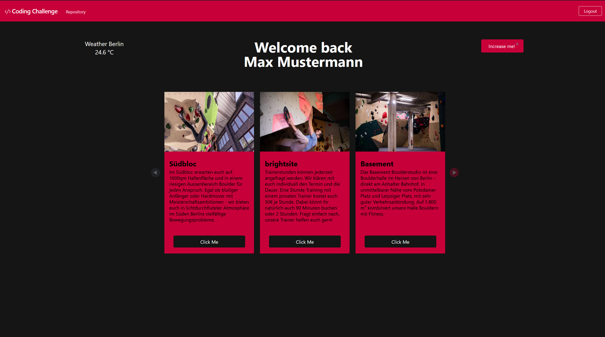

## How to setup the project within a Docker environment

1. Clone the project from this repository 
`git clone https://github.com/Marlowski/coding-challenge`
  
2. In your commandline, if not already there, **cd** to the project file which is named **/coding-challenge**
  
3. Make sure Docker is installed. If you're unsure if you have a working Docker installed,
you can use `docker -v` in your commandline to get the current version of the installed Docker. 
If not installed follow the instructions on [this page](https://docs.docker.com/get-docker/) for your respective os.
  
4. Since this projects uses a docker composer file these two steps **can be skipped**  
~~`docker build . -t DOCKER_PROJECT_NAME` ~~
~~`docker run -e 3000:3000 DOCKER_PROJECT_NAME`~~
  
Instead you only need to run 
`docker compose up`  

In the Docker composer file the port 3000 got declared, therefor you can access the application
via [http://localhost:3000](http://localhost:3000) after the Docker composer finished the build.

### The login credentials are as followed:
**username:** user 
**password:** password
  

